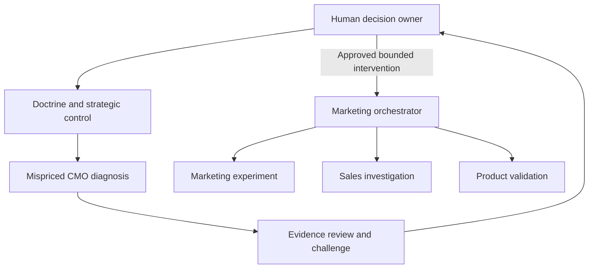

# Mispriced CMO: a cross-division handoff

This is a worked, fictional B2B subscription-product example. Its observations
are scenario inputs, not customer evidence or promised outcomes. It composes the
existing [mispricing diagnostic](../strategy/runbooks/scenario-marketing-mispricing-diagnostic.md)
and [marketing campaign](../strategy/runbooks/scenario-marketing-campaign.md)
runbooks; it does not add another runbook or decision authority.

## One control hierarchy

The human decision owner names the commercial outcome, resource limits, and
delegation in the [Strategic Decision Record](../strategy/templates/strategic-decision-record.md).
The [General Strategy Doctrine](../strategy/GENERAL-STRATEGY-DOCTRINE.md) and
[Strategic Control Plane](../strategy/STRATEGIC-CONTROL-PLANE.md) govern the work.
The [Marketing Operating Model](../strategy/MARKETING-OPERATING-MODEL.md) supplies
domain reasoning. Mispriced CMO supplies diagnosis and recommendations.



Arrows to sales and product are handoffs, not transfers of managerial authority.
The relevant functional owner accepts the work and controls its resources.
A different agent name does not establish independent review: shared evidence,
model, operator, or incentives must be disclosed, and material unresolved
challenge goes to the human decision owner.

## Scenario and routing

The sponsor wants more retained customers within an agreed acquisition budget.
For this example, paid-search conversions rose while retained-customer growth
did not. Interviews suggest onboarding delays, but that explanation remains a
hypothesis until product and sales evidence supports it.

| Stage | Responsible profiles | Input and concrete output | Gate |
|---|---|---|---|
| Diagnose | `mispriced-cmo-diagnostic-lead`, `mispriced-cmo-availability-ledger-analyst`, `mispriced-cmo-measurement-bias-reviewer` | Spend ledger, attribution definitions, cohort retention → classified spend and a list of causal gaps | Do not label attributed conversions as incremental customers |
| Challenge | `marketing-evidence-lead`, `market-demand-mapper`, `marketing-strategic-red-team` | Competing acquisition and onboarding explanations → evidence plan, dissent and falsifiers | Missing cohort evidence means HOLD on reallocation, with a named data owner and review date |
| Sales handoff | `sales-pipeline-analyst`, `sales-discovery-coach` | Lost-deal reasons and stage definitions → reconciled funnel and documented customer objections | Sales owner accepts investigation; agents do not contact prospects without authorization |
| Product handoff | `product-manager`, `product-feedback-synthesizer` | Onboarding events, support issues and objections → a bounded problem statement and validation proposal | Product owner accepts or rejects; the diagnostic does not grant roadmap priority |
| Marketing handoff | `marketing-strategy-orchestrator`, `marketing-growth-hacker`, `support-analytics-reporter` | Approved thesis → experiment brief under the existing campaign runbook | No spend increase before budget, counterfactual, stop conditions and measurement ownership are accepted |
| Close or revise | `mispriced-cmo-repricing-memo-writer`, `mispriced-cmo-proposition-auditor`, human sponsor | Evidence-graded memo, rejected alternatives, unresolved risks and accepted handoffs | Sponsor records adopt / stage / test first / reject with reason |

If product evidence falsifies the onboarding explanation, the team revises the
diagnosis. If paid-search incrementality remains unidentifiable, the memo states
that limit instead of recommending an unsupported budget move.

## Handoff record

Each receiving owner gets the same decision ID and claim register, including:

- Superior outcome and the bounded task being accepted.
- Source paths, observation dates, evidence labels, confidence and missing data.
- Competing explanation, planned test and predeclared falsifier.
- Budget/time ceiling, authorized actions, owner and review date.
- Stop conditions, residual-risk ownership and conditions for reopening.

For this example, success means a justified decision on the binding constraint
and an accepted validation plan. Campaign activity or a polished memo alone
does not demonstrate retained-customer growth. Close the diagnostic when the
sponsor accepts the evidence, limits and handoffs; stop or narrow it if the
minimum cohort/spend evidence cannot be obtained by the agreed review date.

## Make the profiles available

Run from this checkout, using a host that supports selected agent installation:

```bash
bash scripts/install.sh --tool claude-code --runbook marketing-mispricing-diagnostic
# After the owner selects a campaign intervention:
bash scripts/install.sh --tool claude-code --runbook marketing-campaign
# Add these specialists only when the relevant handoff is accepted:
bash scripts/install.sh --tool claude-code --agent sales-pipeline-analyst,sales-discovery-coach,product-manager,product-feedback-synthesizer
```

The diagnostic roster includes an internal commercial profile; keep it out of
client sessions as required by that runbook. Installation makes profiles
available; the host/user selects which to invoke and must supply the referenced
strategy documents. These commands do not execute the scenario or authorize
budget, publication, contact, or deployment.
