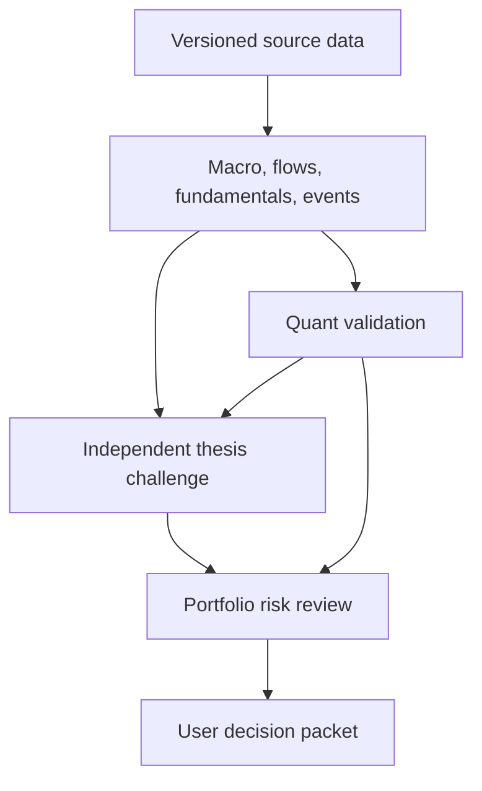

# Alpha Research Suite — Integration & Operating Contract

**Integration contract v1.0.0 · Decision support only · Proposed · Reviewed 2026-10-10**

Six complementary research-agent profiles, each with a distinct mandate, tangible outputs, and a runnable standard-library Python example. This guide defines their handoffs and limits; it is not a seventh agent or a deployed orchestration service.

## Package contents

| Profile | Owns | Hands off |
|---|---|---|
| [01 — Market Data & Research Integrity](../../finance/finance-market-data-research-integrity.md) | Source identity, temporal integrity, normalization, and revisions. | Fit-for-purpose versioned datasets. |
| [02 — Portfolio Risk & Allocation Architect](../../finance/finance-portfolio-risk-allocation-architect.md) | Mandate, exposures, constraints, scenarios, and conditional allocations. | Reviewable portfolio analysis. |
| [03 — On-Chain Capital Flows & Market Structure](../../finance/finance-onchain-capital-flows-market-structure.md) | Canonical flows, entity-label uncertainty, liquidity, and positioning. | Measured features and testable explanations. |
| [04 — Protocol Fundamentals & Token Value Capture](../../finance/finance-protocol-fundamentals-token-value-capture.md) | Economics, supply, and the mechanism of token-holder benefit. | Versioned fundamental theses. |
| [05 — Catalyst & Expectations Analyst](../../finance/finance-catalyst-expectations-analyst.md) | Event timing, frozen expectations, releases, and revisions. | Event hypotheses and post-event evidence. |
| [06 — Investment Thesis Challenger](../../finance/finance-investment-thesis-challenger.md) | Premises, competing explanations, and material defects. | A scoped review disposition and closure conditions. |

The existing Macro Regime agent frames regimes and hypotheses. Quant Research & Alpha Validation tests measurable claims, including incremental evidence after costs. Sentinel reviews smart-contract security. These pre-existing profiles are referenced as integration partners and are not bundled or modified here. SPIDER and Patent Attorney remain available for separate relevant tasks; they do not gain a standing portfolio role through this package.

## Operating principles

1. Begin with the user's purpose, decision, horizon, and constraints. Do not optimize agent activity as a substitute for a useful decision.
2. Distinguish observation, inference, hypothesis, attributed intent, and unknown. A model output is an estimate even when its input data are verified.
3. Match verification effort to decision impact and reversibility. Resolve critical dependencies before optional enrichment.
4. Use exact input versions and as-of cutoffs. A correction can invalidate downstream conclusions.
5. Preserve no-action and insufficient-evidence outcomes. Agreement between agents is not independent evidence.
6. End each task with a disposition, owner, unresolved items, and the event that reopens the work.

“Overdrive” denotes efficient retrieval, reusable computations, scoped checks, and prompt updates. It confers no extra permissions, proprietary data access, live monitoring, guaranteed skill, or guaranteed alpha.

## Research flow and review order



Sentinel findings feed the challenge and risk stages whenever smart-contract exposure is relevant. Security scope and recency must be explicit; an audit is not a permanent safety guarantee. Failed data integrity can block any stage.

Use only the agents needed for the question. A descriptive event summary does not require a portfolio optimizer. A personalized allocation proposal requires a confirmed mandate and holdings. Run independent analysis concurrently only when the actual execution environment and user authorization permit it; this document does not launch agents.

## Common artifact envelope

Every downstream handoff carries these fields, with a role-specific payload:

| Field | Contract |
|---|---|
| `schema_version` | Version of this envelope contract. |
| `artifact_id`, `artifact_version`, `producer` | Stable identity, immutable version, responsible agent. |
| `created_at`, `as_of` | Timezone-aware timestamps; production time versus information cutoff. |
| `scope` | Question, universe, horizon, units, exclusions, and intended use. |
| `input_refs` | Exact input IDs and versions; hashes when actually computed. |
| `review_status` | `DRAFT`, `READY`, `DEGRADED`, or `BLOCKED` for the stated use. |
| `domain_status` | Producer-specific status from its own profile. |
| `claims` | Statement, evidence class, source refs, assumptions, and falsifier where applicable. |
| `limitations`, `open_items` | Material gaps; each open item has owner and closure condition. |
| `next_step`, `execution_authorized` | Research handoff; execution must remain `false`. |

Allowed claim classes: `OBSERVED`, `INFERRED`, `HYPOTHESIS`, `ATTRIBUTED_INTENT`, `UNKNOWN`. A claim cannot become observed because multiple agents repeat it. Source references must identify actual records; invented URLs, vintages, hashes, or retrieval times are prohibited.

`READY` means suitable for the declared research use, not correct in every respect and not approved for trading. Use `DEGRADED` only when permitted and prohibited uses are stated. Critical missing information makes the affected use `BLOCKED`.

The following is a synthetic, intentionally blocked handoff, not a live research result:

```json
{
  "schema_version": "1.0",
  "artifact_id": "synthetic-risk-request-001",
  "artifact_version": "1",
  "producer": "portfolio-risk-allocation-architect",
  "created_at": "2026-01-01T00:00:00Z",
  "as_of": "2026-01-01T00:00:00Z",
  "scope": {
    "question": "Can a personalized allocation be evaluated?",
    "universe": null,
    "horizon": null,
    "units": null,
    "excluded": ["execution"],
    "intended_use": "mandate-completeness review"
  },
  "input_refs": [],
  "review_status": "BLOCKED",
  "domain_status": "BLOCKED",
  "claims": [
    {
      "statement": "Approved loss tolerance is unavailable in this synthetic example.",
      "evidence_class": "UNKNOWN",
      "source_refs": [],
      "assumptions": [],
      "falsifier": null
    }
  ],
  "limitations": ["No holdings or mandate supplied."],
  "open_items": [
    {
      "item": "Portfolio mandate and reconciled holdings",
      "owner": "portfolio-risk-allocation-architect",
      "closure_condition": "User-confirmed mandate and current holdings are recorded."
    }
  ],
  "next_step": "Obtain the missing mandate before personalized sizing.",
  "execution_authorized": false
}
```

## Mandate and hard boundaries

Capital, base currency, portfolio, liquidity needs, permissible leverage, risk budget, and loss limits are unconfirmed. Keep them unknown. Hypothetical examples must be labeled and cannot silently become user preferences.

No profile may place orders, transact on-chain, sign messages, request secret keys, change account settings, or contact third parties through this mandate. Reading authorized sources and producing local research are the intended actions. A future execution system would require a separate, explicit scope and engineering controls; no such system is included.

Raoul Pal's Everything Code and related macro narratives can supply attributed hypotheses. They do not establish a predictive law, fixed liquidity lag, or authorized leverage multiplier. Distinguish strategic, cyclical, and tactical horizons, and test claimed relationships on appropriate data.

The supplied strategy framework provides the reasoning structure. Its chapter XVII conjectures remain separate from established framework claims and from verified market evidence.

## Corrections, disagreement, and closure

A producer correcting a source or method issues a new version, lists affected outputs, and marks dependent results stale. Consumers must re-evaluate before using the corrected chain in a decision packet. Never overwrite the original evidence or move timestamps backward.

Disagreement is resolved by locating the disputed premise, measurement, horizon, or mandate constraint. Do not settle it by agent majority vote. A reproducible data defect, a falsified necessary premise, and a disputed preference require different responses.

A final decision packet contains: question and scope; current evidence; alternatives including no action; Quant results and limitations where applicable; challenge disposition; risk conditions; unresolved items; and a recommended next research or user-review step. It contains no fabricated order approval.

## Reusable invocation

Use an individual profile as the agent's instructions in an authorized host, then supply a task such as:

> Apply the Market Data & Research Integrity profile to these supplied files. Evaluate suitability for a weekly regime study as of the specified UTC cutoff. Preserve original observations and revisions. Return the common envelope, a data-quality report, and a list of blocked uses. Do not fill missing inputs with invented values.

For a full thesis review, specify the question, assets, horizon, available sources, exact as-of cutoff, and confirmed mandate fields. Start with data integrity and activate only the specialist roles that answer a material dependency.

## Validation and practical limits

Each profile contains one self-contained Python block with synthetic assertions. Run each block separately with Python 3; no third-party packages, API keys, or network requests are needed. Tests demonstrate selected arithmetic and guard conditions only. They do not validate live providers, economic truth, forecasting ability, or production security.

Package check on 10 October 2026: all six examples passed using Python 3.12.14. The JSON example parsed successfully and every relative Markdown link resolved to a packaged file.

This package is a set of specifications and reference examples. It does not install agents, connect accounts, backtest a strategy, schedule jobs, or establish realized or expected alpha. Operational success must later be measured against predeclared baselines, costs, uncertainty, and the user's actual purpose.
## Repository integration and epistemic vocabulary

The six installed agent profiles are optional specialists in the canonical `investment-hypothesis-validation` runbook. Existing `finance-macro-regime-alpha` and `finance-quant-alpha-validator` retain their mandatory P8 proposer/challenger gate. The Investment Thesis Challenger provides independent qualitative review and never substitutes for the Quant P8 verdict. Portfolio Risk cannot approve trading.

The suite's `review_status` (`DRAFT`, `READY`, `DEGRADED`, `BLOCKED`), `domain_status` and `evidence_class` are distinct from NEXUS claim statuses (`EVIDENCE`, `HYPOTHESIS`, `ASSUMPTION`, `ATTRIBUTED_INTENT`, `UNKNOWN`) and `decision_state`. An adapter needs an explicit evidence- and reviewer-validated mapping: `OBSERVED` is not automatically `EVIDENCE`, and `READY` never conveys trading permission. This integration installs neither a live host adapter nor a provider connection.

The six stdlib Python examples are synthetic tests of guards and arithmetic, not of investment performance. See [example regression checks](../../scripts/test-alpha-research-suite.py).
