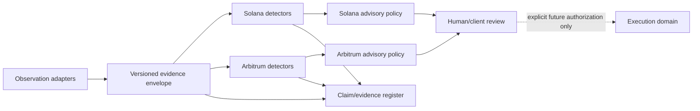

# Gate 0 Artifact 04 — Dual-Chain Domain Map

> **Leads:** E1-SOL Solana Program Engineer + E1-ARB Solidity Smart Contract Engineer  
> **Adversarial review:** S1 Blockchain Security Auditor  
> **Boundary routing:** G1 Chief of Staff  
> **Status:** DRAFT — reconciliation with real protocol APIs/deployments pending

## Architectural invariant

For both networks, keep these domains separate:

`observation → detection → simulation/replay → policy/advice → execution → evidence → presentation`

The same service may implement several domains, but an output from one domain does not silently acquire authority from the next. In particular:

- observed data are not a security conclusion;
- a detector result is not an execution permission;
- policy advice is not a transaction;
- an evidence hash proves integrity of recorded bytes, not truth of the underlying proposition;
- a dashboard must not convert `UNKNOWN` into healthy because users prefer a binary display.

## Common quality states

| State | Meaning | Execution implication |
|---|---|---|
| `UNKNOWN` | insufficient, contradictory or incoherent evidence | none; requires review |
| `UNSUPPORTED` | provider/version/modality is outside validated adapter scope | none; explicit exclusion |
| `INVALID` | source identity, authentication/verification, structure, scale or required time/numeric condition is invalid | none; review with evidence |
| `DEGRADED` | validly observed data fail the frozen market policy | none; WARN/REVIEW according to client policy, not HTP autonomous action |
| `HEALTHY_OBSERVED` | no configured violation detected in what was actually observed | none; not a guarantee or `ALLOW` |

Evaluation order:

`scope/version → identity/authenticity → numeric + clock validity → freshness/quality → auxiliary contrast → evidence dossier`

No ratio is evaluated with an invalid denominator. Future timestamps and absent fields become explicit quality states, not convenient defaults.

---

# A. Solana domain map — E1-SOL

| Domain | Inputs | Function | Output | Hard limit |
|---|---|---|---|---|
| **Observation** | transactions, instructions, account states, oracle/token data, protocol config | collect versioned chain/feed evidence with separate clocks | raw/normalized event + provenance | absence of observation ≠ absence of risk |
| **Detection** | validated events + frozen class policy | classify SOL-ORD / SOL-ORC and quality state | reason-coded finding candidate | no transaction submission or actor attribution by default |
| **Replay / simulation** | frozen snapshots + reconstructible instruction/state sequence | reproduce event or isolate unobservable variables | replay result or explicit partial-analysis status | no hidden hindsight; no external writes |
| **Policy / advice** | detector state, client policy, uncertainty | formulate WARN/REVIEW dossier | advisory recommendation + expiry | does not return signing/execution permission |
| **Execution** | disabled at Gate 0 | none | none | no keys, signing, sending, pausing, liquidating, program changes |
| **Evidence** | raw refs, versions, policy, detector result | create tamper-evident audit trail | immutable/hashed evidence record | integrity hash ≠ factual truth |
| **Presentation** | evidence states + coverage/missingness | show state, uncertainty, scope and pending questions | UI/report/API view | cannot coerce `UNKNOWN` to green/healthy |

## A1. Solana authority subdomain

For every relevant instruction/account path, E1-SOL records:

| Property | Required representation |
|---|---|
| address | canonical address, allowlist or derivation rule |
| runtime owner | owning program ID |
| signer | transaction signer / no signer / PDA signer during CPI |
| writable | yes/no and why |
| account type/state | discriminator/serialization/init/close/realloc constraints |
| relationship | market↔vault↔mint↔authority↔oracle relationships |
| PDA | seeds, canonical bump and capability represented |
| CPI | callee program + accounts + propagated signer/writable privileges |
| token | Token Program or Token-2022 + mint/account authority + relevant extensions |
| admin | upgrade/admin/mint/freeze/delegate authorities relevant to scope |

A PDA address alone is not sufficient proof that the account contains the correct state or economic relationship.

## A2. Solana clocks

Do not collapse:

- provider publication/update time;
- on-chain inclusion/posted slot where applicable;
- transaction slot;
- monitor observation time;
- evidence delivery time;
- client action time.

These clocks are required to distinguish retrospective reconstruction from prospective usefulness.

---

# B. Arbitrum One domain map — E1-ARB

| Domain | Inputs | Function | Output | Hard limit |
|---|---|---|---|---|
| **Observation** | L2 blocks/txs, oracle contracts, sequencer-status evidence, protocol config, RPC/indexer health | collect chain/feed/config evidence while measuring monitor health separately | versioned temporal event | monitor delay ≠ chain delay |
| **Detection** | validated evidence + frozen policy | classify ARB-ORC / ARB-RES independently | state + reason codes + evidence | healthy feed does not imply solvency |
| **Replay / simulation** | historical state/fork/snapshots or labeled synthetic trajectories | reproduce events or test recovery invariants | replay result / synthetic scenario result | synthetic stress is never labeled an incident |
| **Policy / advice** | data integrity, availability, exposure evidence, client policy | formulate WARN/REVIEW + expiration | advisory recommendation | client governance owns pause/resume/liquidation policy |
| **Execution** | disabled at Gate 0 | none | none | no signing, force inclusion, liquidation, pause, upgrade |
| **Evidence** | block/tx/feed refs, clocks, versions, corrections | preserve provenance and revisions | evidence dossier | late data/reorg corrections remain visible |
| **Presentation** | availability, price integrity, exposure, missingness | display separate state dimensions | UI/report/API view | `UP` cannot be displayed as “risk resolved” by implication |

## B1. Arbitrum recovery subdomain

The recovery model is stateful:

```text
UNKNOWN
  ├─ sufficient interruption evidence → DOWN
  └─ sufficient normal evidence → NORMAL
DOWN
  └─ progress/status returns → RECOVERING
RECOVERING
  ├─ new interruption → DOWN
  └─ configured time/data conditions satisfied → READY_FOR_REVIEW
READY_FOR_REVIEW
  ├─ conditions degrade → RECOVERING or DOWN
  └─ client-approved exposure/recovery criteria satisfied → NORMAL
NORMAL
  └─ degradation → corresponding non-normal state
```

A provider signal is one input to the state machine, not an execution command.

## B2. Arbitrum deployed-contract subdomain

E1-ARB records:

- protocol contract addresses;
- proxy/implementation mapping where relevant;
- oracle/feed addresses and interfaces;
- decimals/units and conversion path;
- market configuration/version;
- sequencer-status feed if used;
- RPC/indexer providers as observation dependencies;
- admin/upgrade controls relevant to the monitored path;
- any L1/L2 message path actually required by the proposed use case.

No fallback path is assumed usable merely because it exists architecturally.

---

# C. Shared event/evidence envelope

The following conceptual envelope may be shared across network adapters:

```yaml
event:
  network: solana | arbitrum_one
  protocol: PENDING
  market: PENDING
  feed_identity: null
  adapter_version: PENDING
  policy_version: PENDING
  source_reference: PENDING
  block_or_slot: PENDING
  transaction_id: null
  instruction_index: null
  publish_time: null
  observed_at: PENDING
  finality_status: PENDING
  raw_data_hash: PENDING
  quality_state: UNKNOWN
  reason_codes: []
  network_extensions: {}
```

Arbitrum extensions may include:

- `sequencer_state`
- `status_started_at`
- `recovery_state`
- `position_snapshot_ref`
- `liquidity_snapshot_ref`

Solana extensions may include:

- `program_id`
- `account_refs`
- `posted_slot`
- `token_program_id`
- `token_2022_extensions`
- `cpi_trace_ref`

A null field must have a semantic reason in adapter/evidence metadata when material; it is never filled with an invented placeholder at runtime.

# D. Dependency direction



Execution must not become an implicit dependency of detection during Gate 0.

# E. E1↔S1 acceptance criteria

For each network S1 must be able to answer from the domain map:

- what data enter the system and from where;
- which identities/versions are trusted and why;
- where malformed/missing/unsupported data fail closed to review;
- which component labels the threat class;
- which component can only recommend versus execute;
- what authority/credential would be required for any future live action;
- which clocks determine whether the signal is prospective;
- what economic invariant is being protected;
- what the detector still cannot prove;
- how evidence and corrections remain auditable.

If those answers require unstated assumptions, S1 returns `changes_requested`.

# F. Gate status

The domain map is **structurally drafted** but cannot be accepted for Gate 0 until:

- Solana protocol/program/feed manifests and adapter versions are fixed;
- Arbitrum protocol/market/contract/feed manifests are fixed;
- both E1→S1 handoff cycles reach a recorded disposition;
- real API/deployment semantics are reconciled with these conceptual fields;
- no execution authority has leaked into the observation/detection/policy layers.

Current result: **Gate 0 pending**.