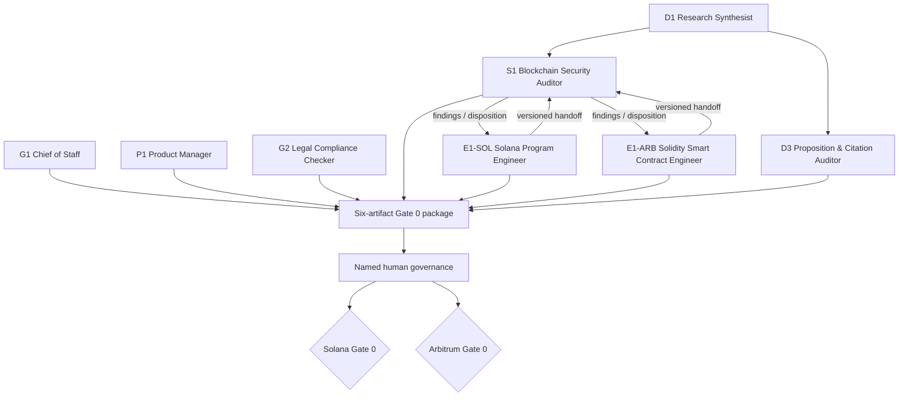

# HTP Runbook — Gate 0 Solana + Arbitrum One

> **Mode:** NEXUS-Sprint  
> **Planning horizon:** 14 planning days  
> **Current state:** Gate 0 pending  
> **Purpose:** close a bounded, lawful, testable dual-network charter without granting live execution authority

---

## Scenario

HTP is evaluating two DeFi monitoring/decision-support workstreams in parallel:

- **Solana:** observable adverse ordering (`SOL-ORD`) and degraded valuation input (`SOL-ORC`).
- **Arbitrum One:** degraded/invalid price consumed (`ARB-ORC`) and outage/recovery with unresolved exposure (`ARB-RES`).

The purpose of Gate 0 is not to ship a detector, trade, liquidate, pause, force-include, upgrade, sign, custody or publish allegations. It is to establish whether each workstream is sufficiently bounded, legally reviewable, technically representable, evidentially honest and falsifiable to justify the next evidence stage.

Solana and Arbitrum run simultaneously as **separate evidentiary tracks**. Common schemas and reviewers may reduce coordination cost; they do not create shared validation.

---

## Concrete agent roster

### Core Gate 0 seats

| Seat | Agent | Slug | Responsibility |
|---|---|---|---|
| **G1** | Chief of Staff | `specialized-chief-of-staff` | Gate coordination, package integrity, named owners, escalation |
| **P1** | Product Manager | `product-manager` | Object/non-object, buyer/loss framing, MVP, falsifiers |
| **S1** | Blockchain Security Auditor | `security-blockchain-security-auditor` | Transversal adversarial review with chain-specific overlays |
| **D1** | Research Synthesist | `research-synthesist` | Source-weighted evidence map and alternative explanations |
| **D3** | Proposition & Citation Auditor | `research-proposition-citation-auditor` | Claim register, citation/status/scope drift control |

### Chain engineering

| Seat | Agent | Slug | Responsibility |
|---|---|---|---|
| **E1-SOL** | Solana Program Engineer | `engineering-solana-program-engineer` | Solana domain/authority/account/CPI/token/oracle semantics |
| **E1-ARB** | Solidity Smart Contract Engineer | `engineering-solidity-smart-contract-engineer` | Arbitrum EVM/L2 contract/oracle/recovery semantics |

### Mandatory supporting legal review

| Seat | Agent | Slug | Responsibility |
|---|---|---|---|
| **G2** | Legal Compliance Checker | `support-legal-compliance-checker` | Draft/issue-spot jurisdiction and activity perimeter; human/legal sign-off remains external to agent authority |

See: `strategy/htp-gate0/agent-mapping.md`.

---

## Network overlays

Every mapped agent must apply the relevant overlay in addition to its base profile:

- Solana: `strategy/htp-gate0/overlays/solana.md`
- Arbitrum One: `strategy/htp-gate0/overlays/arbitrum.md`

The overlay wins if a generic agent habit conflicts with HTP scope. In particular:

- S1's EVM-centric audit examples do not define Solana methodology.
- E1-ARB cannot generalize Solidity/EVM assumptions into Solana.
- E1-SOL cannot generalize accounts/PDA/CPI controls into Arbitrum without translation.
- D3 must prevent cross-network evidence/status leakage.

---

## Six-artifact Gate 0 package

| # | Artifact | Lead | Required output |
|---|---|---|---|
| 01 | `strategy/htp-gate0/gate0/01-object-non-object.md` | G1 + P1 | separate bounded object/non-object per network |
| 02 | `strategy/htp-gate0/gate0/02-jurisdiction-activity.md` | G2 | activity/jurisdiction issue map; signed legal status remains pending until a competent human authority resolves it |
| 03 | `strategy/htp-gate0/gate0/03-threat-model.md` | S1 + D1 | one protocol/network, maximum two classes per network, alternatives and evidence gaps |
| 04 | `strategy/htp-gate0/gate0/04-domain-map.md` | E1-SOL + E1-ARB | observation/detection/simulation/policy/execution/evidence boundaries with chain-specific semantics |
| 05 | `strategy/htp-gate0/gate0/05-claim-registers.yaml` | D3 | two empty claim registers, shared schema, no shared validation |
| 06 | `strategy/htp-gate0/gate0/06-mvp-falsifiers.md` | P1 | customer hypothesis, loss-to-buy-down logic, technical/opportunity/economic falsifiers |

The package is **one documentary Gate** but contains two independent network decisions. Governance may pass one network and block the other.

---

## E1 ↔ S1 contract

All chain-engineering/security transfers use:

`strategy/htp-gate0/handoff-e1-s1.md`

Required before Gate decision:

1. E1-SOL → S1 review package.
2. S1 → E1-SOL findings/disposition.
3. E1-SOL remediation or recorded disagreement.
4. E1-ARB → S1 review package.
5. S1 → E1-ARB findings/disposition.
6. E1-ARB remediation or recorded disagreement.
7. D3 check that resulting wording does not overstate either review.

A completed cycle on one chain does not satisfy the other.

---

## Planning schedule

The day numbers are sequencing aids, not a promise or substitute for authority.

| Planning day | Lead | Deliverable / decision |
|---|---|---|
| 1–2 | G1 + P1 | Finalize Artifact 01; name candidate buyer/protocol or record scope consequence |
| 3–4 | G2 | Finalize Artifact 02 issue map; identify the competent human/legal review required |
| 5–6 | S1 + D1 | Finalize Artifact 03 with ≤2 threat classes per network and strongest alternatives |
| 7 | E1-SOL + E1-ARB | Finalize Artifact 04; submit separate E1→S1 handoffs |
| 8 | D3 | Validate Artifact 05 schemas remain empty and correctly scoped; audit claim drift in 01–04 |
| 9 | D1 + D3 | Cross-network transfer audit: list what is truly common and what cannot transfer |
| 10 | P1 | Finalize Artifact 06; freeze the list of parameters that must be set before evaluation |
| 11 | S1 + E1s | Resolve or explicitly escalate technical findings; no silent disagreement closure |
| 12 | G1 | Record named human owners/reviewers and expiry/termination conditions for unresolved work |
| 13 | G1 + D3 | Package audit: no unsupported numbers, scope inflation, hidden execution authority or status upgrades |
| 14 | Human governance | Separate Solana and Arbitrum Gate 0 decisions: PASS / REDESIGN / HOLD / STOP |

---

## Workstream topology

---

## Gate criteria

### Common mandatory criteria

- [ ] all six artifacts exist at immutable/versioned references;
- [ ] G1, P1, S1, D1, D3 and both E1 assignments resolve to real agent files;
- [ ] G2 legal activity memo has the required competent human review/sign-off status recorded;
- [ ] accountable human product, security/architecture and governance reviewers are named;
- [ ] each network names one protocol and the markets/contracts/programs/feeds needed for its scope;
- [ ] each network contains no more than two approved threat classes;
- [ ] E1↔S1 handoff cycle has a recorded outcome for each network;
- [ ] claim registers remain independent by network;
- [ ] every material empirical proposition is either registered at the correct evidence status or clearly marked as documentary/hypothesis;
- [ ] quantitative test parameters are marked pending rather than filled with arbitrary universal thresholds;
- [ ] no live execution authority is embedded in detection/policy artifacts;
- [ ] an independent human/governance review records the Gate decision.

### Solana-specific

- [ ] deployed program/feed/adapter manifest is fixed;
- [ ] SOL-ORD and SOL-ORC definitions/alternatives are accepted;
- [ ] account/authority/PDA/CPI/token semantics are explicit where relevant;
- [ ] ex-post versus prospective timing is measurable and not conflated;
- [ ] unsupported provider/version becomes `UNSUPPORTED`, not healthy.

### Arbitrum One-specific

- [ ] deployed protocol/market/oracle/proxy manifest is fixed;
- [ ] ARB-ORC and ARB-RES definitions/alternatives are accepted;
- [ ] RPC/monitor health is separated from sequencer/network state;
- [ ] exact consumed-price reconstruction path is defined or limitation is explicit;
- [ ] recovery is modeled as a state transition with exposure review, not binary `UP=safe`.

---

## Gate outcomes

Gate 0 is decided **per network**.

| Outcome | Meaning | Next action |
|---|---|---|
| `PASS_TO_EVIDENCE_FOUNDATION` | charter is bounded, legally reviewed for the planned activity, technically representable and testable | freeze dataset/manifests/parameters and build reproducible benchmark only |
| `REDESIGN` | core object remains valuable but threat model/domain/product logic is defective or untestable as written | revise affected artifacts and repeat relevant handoffs |
| `HOLD` | potentially viable but blocked by missing client, legal review, access, data or accountable owner | do not build production paths; wait or reduce scope |
| `STOP` | object is inadmissible, unobservable, economically pointless, or outside risk tolerance | terminate the scoped workstream and record reason |

A document author or agent cannot self-issue `PASS_TO_EVIDENCE_FOUNDATION`.

---

## Prohibited actions before Gate 0 pass

The following are prohibited by this runbook unless a separate, explicit, authorized process supersedes the Gate for a narrowly defined emergency or research environment:

- production writes;
- signing or submitting real transactions;
- custody or key handling;
- live liquidation;
- live pause/unpause;
- program/contract upgrade;
- forced inclusion;
- routing client capital;
- unauthorized interaction with third-party systems;
- exploit execution against live third parties;
- public naming/attribution of suspected actors without proper authority/evidence;
- marketing empirical performance that is not in the claim register at a supported status;
- importing one chain's validation as the other chain's evidence.

---

## Validation stages after a Gate pass

A Gate pass permits only the next bounded evidence stage, not production.

| Question | Evidence stage | Still not proved |
|---|---|---|
| Does it classify what it can observe? | closed frozen replay/benchmark | prospective timing, adoption, economic benefit |
| Is the signal available with useful margin? | shadow observation with clocks | client adoption or loss reduction |
| Does adopted action improve net outcome? | separately authorized protected pilot with pre-specified comparison | generalization to other protocols/networks |

The pilot must not remove existing client protections merely to manufacture a control group.

---

## Parameters frozen before benchmark/shadow evaluation

For each network/class, record before evaluating outcomes:

- eligible protocol/market population;
- label definitions;
- minimum useful precision/recall/coverage;
- treatment of `UNKNOWN` and non-evaluable cases;
- feed/market freshness and quality policy;
- prospective reaction-time requirement;
- minimum economic effect;
- sample/information target;
- uncertainty method;
- evidence budget;
- termination/review date.

If these cannot be set responsibly because there is no client or dataset, the correct Gate state is `HOLD`, not invented precision.

---

## Current package status

As initially committed, the runbook and six artifacts are **structurally present**, but both workstreams remain **Gate 0 pending** because key real-world inputs are not yet supplied:

- named client/protocol scopes;
- deployed manifests/adapters;
- quantitative evaluation parameters;
- competent legal sign-off where required;
- named human accountable owners/reviewers;
- independent Gate decision;
- completed E1↔S1 review cycles over the final manifests.

This is intentional. The runbook defines how to close Gate 0 without pretending that drafting the paperwork is equivalent to passing it.